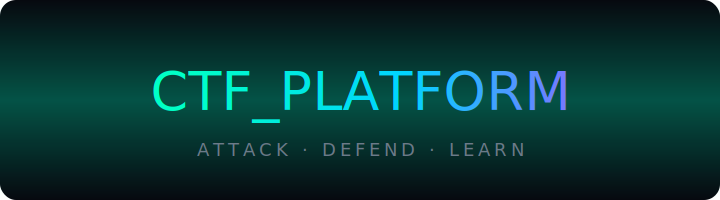

# CTF PLATFORM // NEON OPS

<p align="center">
  
</p>

<p align="center">
  
</p>

<p align="center">
  
</p>

> A kinetic Capture The Flag range built with Flask + SQLAlchemy + MySQL. Pair with synthwave and a dark terminal.

---

## Highlights

- Challenge browser with live filtering by **category + difficulty + search** (PicoCTF vibes).
- Secure flag flow: SHA256 hashing + cooldowns + duplicate-solve guard.
- Rich admin console: create/edit/toggle/delete challenges, upload files, manage users.
- Built-in hints with point penalties and personal accuracy stats.
- Neon UI (Rajdhani + Share Tech Mono) ready for dark dashboards.

---

## Stack & Layout

```
ctf_platform/
├─ app/
│  ├─ __init__.py          # App factory + DB bootstraps (auto adds new cols)
│  ├─ extensions.py        # db, login_manager, csrf
│  ├─ models.py            # User, Challenge (with difficulty), Solve, etc.
│  ├─ utils.py             # flag hashing, uploads, categories, difficulties
│  ├─ auth/                # auth routes/forms
│  ├─ challenges/          # player routes/services (filters, hints, cooldowns)
│  ├─ scoreboard/          # leaderboard
│  ├─ admin/               # admin routes/forms/templates
│  ├─ templates/           # Jinja views (dark UI)
│  └─ static/              # css/js/assets/uploads
├─ config.py               # env profiles
├─ seed.py                 # bootstrap admin + sample challenges
├─ run.py                  # flask entry
└─ requirements.txt
```

---

## Quickstart

```bash
python -m venv venv
source venv/bin/activate      # or venv\Scripts\activate on Windows
pip install -r requirements.txt

mysql -u root -p -e "CREATE DATABASE ctf_platform CHARACTER SET utf8mb4 COLLATE utf8mb4_unicode_ci;"

cp .env.example .env          # set DATABASE_URL + SECRET_KEY
python seed.py                # creates adminx3/hack4govx1mpvl$e + sample challenges
python run.py                 # visit http://localhost:5000
```

Admin flow: log in → Admin tab → build challenges (category, difficulty, points, hints, attachment).  
Player flow: register → filter by vibe (web/crypto/pwn…) & difficulty → solve → climb the scoreboard.

---

## Security Posture

| Layer         | Mechanism                                                        |
| ------------- | ---------------------------------------------------------------- |
| Passwords     | PBKDF2-SHA256 (`generate_password_hash`)                         |
| Flags         | SHA256 digest only; constant-time compare                        |
| Abuse control | Duplicate-solve constraint; cooldown after streak of wrong flags |
| CSRF          | Flask-WTF tokens everywhere                                      |
| Uploads       | Extension allowlist + `secure_filename`                          |
| Admin         | `@admin_required` 403 gate                                       |

---

## Operational Notes

- Difficulty column auto-migrates on start; seed script tags samples with easy/medium.
- Run `python seed.py` again if you want fresh demo data after schema tweaks.
- For production: use gunicorn/uwsgi behind nginx, rotate SECRET_KEY, harden MySQL creds.

---

## Render Deployment

- This repo now includes `render.yaml` for a free Render web service.
- The app defaults to `production` config when `APP_ENV`/`FLASK_ENV` is not set.
- `DATABASE_URL` can use Aiven's raw `mysql://...` format; the app converts it to `mysql+pymysql://...`.
- If `DATABASE_URL` includes `ssl-mode=REQUIRED`, the app automatically uses `ca.pem` for TLS verification when available.
- Render sets `MYSQL_SSL_CA` to `/opt/render/project/src/ca.pem` so the included certificate file is used at runtime.
- Render checks `/healthz`, which verifies the app can answer and the database is reachable.
- Optional bootstrap admin: set `ADMIN_USERNAME`, `ADMIN_EMAIL`, and `ADMIN_PASSWORD` in Render once; the app creates or promotes that user on startup.
- Challenge descriptions are rendered as text with line breaks, not trusted HTML; challenge links are restricted to `http`/`https`.

Set these Render environment variables:

```text
APP_ENV=production
DATABASE_URL=mysql://avnadmin:<YOUR_PASSWORD>@mysql-hack4gov-kleinricm-ae22.i.aivencloud.com:16267/defaultdb?ssl-mode=REQUIRED
ADMIN_USERNAME=admin
ADMIN_EMAIL=admin@example.com
ADMIN_PASSWORD=<strong-password>
```

Notes:

- Keep `ca.pem` in the repo root, or set `MYSQL_SSL_CA` to the certificate path if you move it.
- Render free instances have ephemeral disk, so uploaded challenge files stored on local disk are not durable across redeploys/restarts.

---

### Hack the planet

Spin it up, drop in your own challenges, and let the neon scoreboard glow. PRs welcome.
