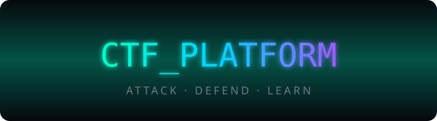
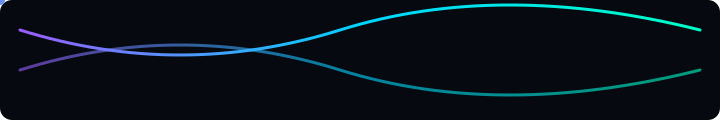

# CTF PLATFORM // NEON OPS

  

  

  

> A kinetic Capture The Flag range built with Flask + SQLAlchemy + MySQL. Pair with synthwave and a dark terminal.

---

## Highlights

- Challenge browser with live filtering by **category + difficulty + search** (PicoCTF vibes).
- Secure flag flow: SHA256 hashing + cooldowns + duplicate-solve guard.
- Rich admin console: create/edit/toggle/delete challenges, upload files, manage users.
- Built-in hints with point penalties and personal accuracy stats.
- Neon UI (Rajdhani + Share Tech Mono) ready for dark dashboards.

---

## Security Posture

| Layer         | Mechanism                                                        |
| ------------- | ---------------------------------------------------------------- |
| Passwords     | PBKDF2-SHA256 (`generate_password_hash`)                         |
| Flags         | SHA256 digest only; constant-time compare                        |
| Abuse control | Duplicate-solve constraint; cooldown after streak of wrong flags |
| CSRF          | Flask-WTF tokens everywhere                                      |
| Uploads       | Extension allowlist + `secure_filename`                          |
| Admin         | `@admin_required` 403 gate                                       |

---

### Hack the planet

Spin it up, drop in your own challenges, and let the neon scoreboard glow. PRs welcome.
